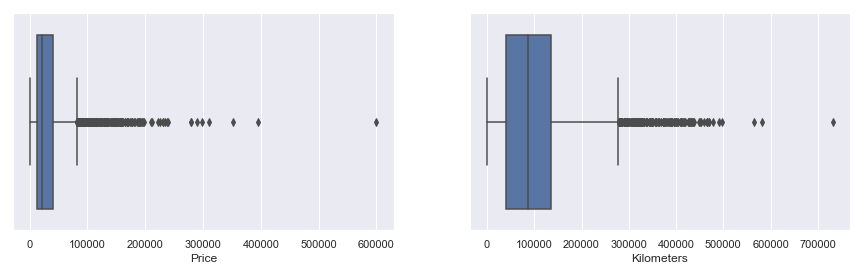
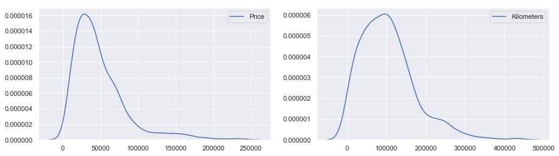
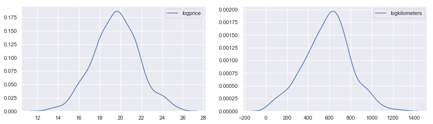

# Webscraping Data

Over the past few years, the online Auctioning site BringATrailer.com has hosted tens of thousands of auctions for used cars. Many of these cars are Oldtimers, i.e. thirty or more years old. While each auction page is created by the seller (and is anything but standardized), I created a Webscraper to scrape features that are relevant to the ultimate price of the car. These include kilometers driven, model, engine, and decade built. The Webscraper works in two steps

1. It creates a list of links to all past auction result pages
2. It scrape each auction result page individually, and compiles the Data in a Pandas DataFrame

Below, we run the Webscraper and collect data from 10,000+ Auction results

```python
import pickle
import pandas as pd
import numpy as np
import matplotlib.pyplot as plt
import seaborn as sns

from scipy.stats import boxcox
from scipy.special import inv_boxcox

from sklearn.linear_model import Ridge, Lasso
from sklearn import tree
from sklearn.tree import export_graphviz
from sklearn.ensemble import RandomForestRegressor
from sklearn.metrics import mean_squared_error, r2_score
from sklearn.decomposition import PCA
from sklearn.model_selection import train_test_split, GridSearchCV
import statsmodels.api as sm
from scipy.stats.stats import pearsonr
import ipywidgets as widgets
from ipywidgets import interact, interact_manual
from sklearn.externals.six import StringIO  
from IPython.display import Image  

import pydotplus

import webscraper, data_cleansing, feature_engineering
sns.set()
```

```python
# Create a csv of links to Oldtimer Auction results
webscraper.scrape_oldtimer_links()
```

```python
# Read links to Auction results into a list
auction_result_links_df = pd.read_csv('./datasets/auction_result_links.csv')
auction_result_links = list(auction_result_links_df.url)
```


```python
# Scrape individual Pages of Auction results for Oldtimer Details.
oldtimer_df = webscraper.scrape_oldtimer_auction_results(auction_result_links)
```


    ['https://bringatrailer.com/listing/2003-mercedes-benz-g500-7/',
     'https://bringatrailer.com/listing/1968-ford-mustang-39/',
     'https://bringatrailer.com/listing/1966-chevrolet-corvette-27/',
     'https://bringatrailer.com/listing/1967-mercedes-benz-230sl-9/',
     'https://bringatrailer.com/listing/2005-mercedes-benz-g55-amg-grand-edition/']


# Data Preprocessing

The Webscraped Data is anything but clean. It contains cars that are not in running condition, significant outliers in price and number of Kilometers driven. All the categorical features also have to be one-hot encoded, including the Model, and the engine type. This is done using helper functions in the data_cleansing.py and feature_engineering.py files.

There are also more than 200+ models in the complete Dataset. In order to build a reasonable Linear Model, we will only focus on cars built by Porsche.


```python
oldtimer_df = pd.read_csv('./datasets/oldtimers.csv')
```


```python
oldtimer_df.head(3)
```


<table border="1" class="dataframe">
  <thead>
    <tr style="text-align: right;">
      <th></th>
      <th>Lot Number</th>
      <th>Chassis Number</th>
      <th>Running Condition</th>
      <th>Seller</th>
      <th>Location</th>
      <th>Model</th>
      <th>Year</th>
      <th>Kilometers</th>
      <th>Engine</th>
      <th>Gearbox</th>
      <th>Date</th>
      <th>Price</th>
    </tr>
  </thead>
  <tbody>
    <tr>
      <th>0</th>
      <td>20950.0</td>
      <td>WDCYR49E03X141381</td>
      <td>True</td>
      <td>1600veloce</td>
      <td>North Salem, New York 10560</td>
      <td>Mercedes-Benz Gelandewagen</td>
      <td>2003.0</td>
      <td>88000.0</td>
      <td>5.0L V8</td>
      <td>5-Speed Automatic Transmission</td>
      <td>2019-07-16</td>
      <td>43750.0</td>
    </tr>
    <tr>
      <th>1</th>
      <td>17145.0</td>
      <td>8R01C166900</td>
      <td>True</td>
      <td>Ty_Cary</td>
      <td>Mercer Island, Washington 98040</td>
      <td>Ford Mustang 1967-1968</td>
      <td>1968.0</td>
      <td>22000.0</td>
      <td>302ci V8</td>
      <td>4-Speed Manual Gearbox</td>
      <td>2019-03-18</td>
      <td>11000.0</td>
    </tr>
    <tr>
      <th>2</th>
      <td>15914.0</td>
      <td>194376S112973</td>
      <td>True</td>
      <td>SLGGR</td>
      <td>Topeka, Kansas 66614</td>
      <td>Chevrolet Corvette C2</td>
      <td>1966.0</td>
      <td>72000.0</td>
      <td>Numbers-Matching 427ci L72 V8</td>
      <td>4-Speed Manual Transmission</td>
      <td>2019-01-30</td>
      <td>83000.0</td>
    </tr>
  </tbody>
</table>
</div>


```python
#Almost eight thousand entries
len(oldtimer_df)
```


    8101


```python
# Drops rows with missing values, cars that aren't in working condition, etc.
oldtimer_df = data_cleansing.cleanse_data(oldtimer_df)
```


```python
# There are some significant outliers in Price and the nunber of Kilometers Driven.
plt.rcParams["figure.figsize"] = (15,4)
fig, ax =plt.subplots(1,2)
sns.boxplot(oldtimer_df.Price, ax=ax[0]);
sns.boxplot(oldtimer_df.Kilometers, ax=ax[1]);
```





```python
# Over 200 unique car models. That's too many to one-hot encode...
oldtimer_df.Model.nunique()
```


    244


```python
# Instead let's just focus on Porsche
porsche_df = oldtimer_df.loc[oldtimer_df["Model"].str.contains('Porsche')]
```


```python
# Now we only have 24 Unique Models
porsche_df.Model.nunique()
```


    24


```python
# We remove oldtimers that cost more than $250,000,
# and oldtimers that have driven more than 450,000 kilometers
porsche_df = data_cleansing.remove_outliers(porsche_df)
```


```python
# But still more than 13,000 entries
len(porsche_df)
```


    1094


```python
# We one-hot model, engine and gearbox features
porsche_df = feature_engineering.engineer_basic_features(porsche_df)
porsche_df = feature_engineering.engineer_engine_features(porsche_df)
```


```python
# the final list of features
print(list(porsche_df.columns))
```

    ['Kilometers', 'Price', 'Intercept', 'Gearbox', 'Year', 'Porsche 356 Speedster', 'Porsche 912', 'Porsche 914', 'Porsche 924', 'Porsche 928', 'Porsche 930 Turbo', 'Porsche 944', 'Porsche 944 Turbo', 'Porsche 964 911', 'Porsche 964 Turbo', 'Porsche 968', 'Porsche 991 911', 'Porsche 993 911', 'Porsche 993 Turbo', 'Porsche 996 911', 'Porsche 996 911 Turbo', 'Porsche 997 911', 'Porsche 997 Turbo', 'Porsche Boxster', 'Porsche Cayman', 'Porsche GT3', 'Porsche Impact Bumper 911', 'Porsche Longhood 911', 1960, 1970, 1980, 1990, 2000, 2010, 2019, 'Engine Rebuilt', 'Twin Turbocharged', 'Engine Turbocharged', 'Original Engine', '1.6L', '1.7L', '1.8L', '2.0L', '2.2L', '2.4L', '2.5L', '2.7L', '2.9L', '3.0L', '3.2L', '3.3L', '3.4L', '3.5L', '3.6L', '3.8L', '4.0L', '4.5L', '4.7L', 'Flat Six', 'Flat Four', 'Inline Four', 'V8']


## Normalizing Price and Kilometers Driven

Both the price, and Kilometers driven are not normally distributed. I apply a Box Cox transformation to normalize them, and improve the fit of the Linear Model.


```python
plt.rcParams["figure.figsize"] = (15,4)
fig, ax = plt.subplots(1,2)
sns.kdeplot(porsche_df.Price, ax=ax[0]);
sns.kdeplot(porsche_df.Kilometers, ax=ax[1]);
```





```python
#Create two Transformed Columns
porsche_df["logprice"], price_lambda = boxcox(porsche_df["Price"])
porsche_df["logkilometers"], kilometers_lambda = boxcox(porsche_df["Kilometers"])
```


```python
plt.rcParams["figure.figsize"] = (15,4)
fig, ax =plt.subplots(1,2)
sns.kdeplot(porsche_df.logprice, ax=ax[0]);
sns.kdeplot(porsche_df.logkilometers, ax=ax[1]);
```





# Modeling

I will try out a range of different Linear models including Linear, Ridge, Lasso, and ElasticNet Regression with Cross-Validation. I will also try out Decision Trees and Random Forests as most of the data is categorical, and has been one hot encoded.

# Linear Regression

I am going to create a linear model to predict the price of a Porsche at Auction using features webscraped from BringATrailer.com. These features include the total number of kilometers driven, the model of the car, the decade it was built, the type and size of engine, and whether the engine is original, and whether it was ever rebuilt. Almost all of these features are categorical and have been one-hot encoded. This leads to a very large Condition Number as the Model is highly sensitive to errors in input - a different model car changes the price prediction significantly.

The Linear Regression model also assumes that:

1. The predictor - response Relationship is Linear
2. The error terms are uncorrelated
3. The error terms have constant variance
4. There are few or no significant outliers
5. There are no observations with high leverage.
6. Predictor Variables aren't significantly colinear with one another

As we build the model, we will be sure to make sure these assumptions have been met.


```python
X = porsche_df.drop(["Price", "Kilometers", "logprice", "Gearbox", "Year"], axis=1)
y = porsche_df["Price"]

X_train, X_test, y_train, y_test = train_test_split(X, y, test_size=0.2, random_state=42)
```


```python
X_train.head(3)
```

<table border="1" class="dataframe">
  <thead>
    <tr style="text-align: right;">
      <th></th>
      <th>Intercept</th>
      <th>Porsche 356 Speedster</th>
      <th>Porsche 912</th>
      <th>Porsche 914</th>
      <th>Porsche 924</th>
      <th>Porsche 928</th>
      <th>Porsche 930 Turbo</th>
      <th>Porsche 944</th>
      <th>Porsche 944 Turbo</th>
      <th>Porsche 964 911</th>
      <th>...</th>
      <th>3.6L</th>
      <th>3.8L</th>
      <th>4.0L</th>
      <th>4.5L</th>
      <th>4.7L</th>
      <th>Flat Six</th>
      <th>Flat Four</th>
      <th>Inline Four</th>
      <th>V8</th>
      <th>logkilometers</th>
    </tr>
  </thead>
  <tbody>
    <tr>
      <th>34</th>
      <td>1</td>
      <td>0</td>
      <td>0</td>
      <td>0</td>
      <td>0</td>
      <td>0</td>
      <td>0</td>
      <td>1</td>
      <td>0</td>
      <td>0</td>
      <td>...</td>
      <td>0</td>
      <td>0</td>
      <td>0</td>
      <td>0</td>
      <td>0</td>
      <td>0</td>
      <td>0</td>
      <td>1</td>
      <td>0</td>
      <td>378.157010</td>
    </tr>
    <tr>
      <th>5790</th>
      <td>1</td>
      <td>0</td>
      <td>0</td>
      <td>0</td>
      <td>0</td>
      <td>0</td>
      <td>0</td>
      <td>0</td>
      <td>0</td>
      <td>0</td>
      <td>...</td>
      <td>0</td>
      <td>0</td>
      <td>0</td>
      <td>0</td>
      <td>0</td>
      <td>1</td>
      <td>0</td>
      <td>0</td>
      <td>0</td>
      <td>378.857507</td>
    </tr>
    <tr>
      <th>7621</th>
      <td>1</td>
      <td>0</td>
      <td>0</td>
      <td>0</td>
      <td>0</td>
      <td>0</td>
      <td>0</td>
      <td>0</td>
      <td>0</td>
      <td>0</td>
      <td>...</td>
      <td>0</td>
      <td>0</td>
      <td>0</td>
      <td>0</td>
      <td>0</td>
      <td>1</td>
      <td>0</td>
      <td>0</td>
      <td>0</td>
      <td>755.424456</td>
    </tr>
  </tbody>
</table>
<p>3 rows × 59 columns</p>
</div>


```python
lsm = sm.OLS(y_train, X_train)
fit = lsm.fit()
fit.summary()
fit.save("linear_model.pickle")
```

# Model Interpretation
Statsmodels provides a large number summary metrics and statistics after the fit. Here's what I'm looking at.

* The F-Statistic is very high, so we can reject the null hypothesis that there is no relationship between any of the predictors and the target variable
* The P-Value for most of the predictor variables is close to zero with some notable exceptions. Some models, such as the Porsche 993 Turbo have high p-values, suggesting that they are not statistically significant to the overall model
* The coefficient for logkilometers is negative, suggesting that (as expected) the value of a car depreciates the more it's been driven. However, as the feature has been transformed using Boxcox, this coefficient doesn't actually tell us by how much it decreases
* The high Omnibus shows that the Error terms are normally distributed - there's no skew or excess kurtosis
* There's a slight positive skew, and some Kurtosis
* The condition number is high, but this is expected as most of the data is one-hot encoded, and there is some multicollinearity


```python
# Create a confidence interval for each prediction
predictions = fit.get_prediction(X_test)
predictions.summary_frame(alpha=0.05).head()
```

<table border="1" class="dataframe">
  <thead>
    <tr style="text-align: right;">
      <th></th>
      <th>mean</th>
      <th>mean_se</th>
      <th>mean_ci_lower</th>
      <th>mean_ci_upper</th>
      <th>obs_ci_lower</th>
      <th>obs_ci_upper</th>
    </tr>
  </thead>
  <tbody>
    <tr>
      <th>3509</th>
      <td>20.313091</td>
      <td>0.304374</td>
      <td>19.715643</td>
      <td>20.910539</td>
      <td>18.150971</td>
      <td>22.475211</td>
    </tr>
    <tr>
      <th>1099</th>
      <td>21.220102</td>
      <td>0.232519</td>
      <td>20.763696</td>
      <td>21.676507</td>
      <td>19.092632</td>
      <td>23.347571</td>
    </tr>
    <tr>
      <th>713</th>
      <td>19.724904</td>
      <td>0.133645</td>
      <td>19.462575</td>
      <td>19.987233</td>
      <td>17.630474</td>
      <td>21.819334</td>
    </tr>
    <tr>
      <th>6880</th>
      <td>20.002938</td>
      <td>0.280526</td>
      <td>19.452300</td>
      <td>20.553577</td>
      <td>17.853282</td>
      <td>22.152594</td>
    </tr>
    <tr>
      <th>5356</th>
      <td>17.936567</td>
      <td>0.197256</td>
      <td>17.549377</td>
      <td>18.323757</td>
      <td>15.822865</td>
      <td>20.050269</td>
    </tr>
  </tbody>
</table>
</div>


```python
# Calculate Mean Squared Error for the Test Set
y_pred = fit.predict(X_test)
mse = mean_squared_error(y_test, y_pred)
r_squared = r2_score(y_test, y_pred)
adj_r_squared = 1 - (1-r_squared)*(len(y_train)-1)/(len(y_train)-X_train.shape[1]-1)
print("Mean Squared Error: ", mse)
print("R^2 Score: ", r_squared)
print('Adj. R^2 Score: ', adj_r_squared)
```

    Mean Squared Error:  1.0624676417100534
    R^2 Score:  0.7775426600589838
    Adj. R^2 Score:  0.7614383863700023


```python
results = pd.DataFrame(columns=['Model', 'Hyperparameters', 'R^2', 'Adj. R^2', 'MSE'])
results = results.append({'Model' : 'Linear Regression', 'Hyperparameters' : '', "R^2" : r_squared,
                'Adj. R^2' : adj_r_squared, "MSE" : mse}, ignore_index=True)
results.head()
```

<table border="1" class="dataframe">
  <thead>
    <tr style="text-align: right;">
      <th></th>
      <th>Model</th>
      <th>Hyperparameters</th>
      <th>R^2</th>
      <th>Adj. R^2</th>
      <th>MSE</th>
    </tr>
  </thead>
  <tbody>
    <tr>
      <th>0</th>
      <td>Linear Regression</td>
      <td></td>
      <td>0.777543</td>
      <td>0.761438</td>
      <td>1.062468</td>
    </tr>
  </tbody>
</table>
</div>


# Model Evaluation


## 1. Non-Linearity in the Data
We plot the residuals for each of the Predictor variables in order to identify non-linear relationships in the data. There is no discernable pattern for logkilometers, i.e. the feature we created by transforming the number of kilometers a car has driven. Thus, the relationship between logprice and logkilometers seems to be quite linear. We can't evaluate the residuals for all the other features that have been one-hot encoded.


```python
@interact
def show_residuals(column = widgets.IntSlider(min=1, max=58, step=1, value=58)):
    return sns.residplot(X.iloc[:, column], y, lowess=True, color='g');
```


    interactive(children=(IntSlider(value=58, description='column', max=58, min=1), Output()), _dom_classes=('widg…


## 2. Correlation of Error Terms
As there isn't a strong time-series component in auction data from various different cars, it's rather unlikely that the error terms are correlated. Moreover, the Durbin-Watson statistic, which tests for autocorrelation with lag 1, is not substantially less than 2 at 1.955

## 3. Non-Constant Variance in Error Terms (Heteroskedasticity)
A funnel shape in the residual plots indicates that the variance in error terms isn't constant. While this isn't the case for logkilometers, we can't do residual analysis for all the one-hot encoded variables.

## 4. Precense of Outliers
Most of the obvious outliers including cars that sold for more than $250,000 and had driven for more than 450,000 kilometers were removed during preprocessing. There also aren't any visible outliers in the residual plot for Logkilometers. Variables that have been one-hot encoded, by definition, can't have outliers.

## 5. High Leverage Points
Given the residual plot for log-kilometers, there are no obvious points with high leverage. One-hot encoded variables can't have high leverage by definition.

## 6. Collinearity
Linear Regression assumes that none of the features are collienar. This presents a bit of a problem, as many of the features in this model are inherently somewhat collinear. For example, the Pearson Correlation between the "Porsche Impact Bumper 911", and "1980" is .45 as most of the Porsche's in that series were built between 1980 and 1990. However, there doesn't seem to be a serious problem with Colinearity.


```python
pearsonr(X['Porsche Impact Bumper 911'], X[1980])
```


    (0.4514104593747422, 4.934502479818482e-56)


# Ridge Regression

Let's also try  Ridge Regression using a grid-search and cross-validation with 5 folds.


```python
alpha_values = np.linspace(0, 1, 1000)
ridge_regressor = Ridge()
grid = GridSearchCV(estimator=ridge_regressor, param_grid=dict(alpha=alpha_values), cv=5)
grid.fit(X_train, y_train)
```


    GridSearchCV(cv=5, error_score='raise-deprecating',
           estimator=Ridge(alpha=1.0, copy_X=True, fit_intercept=True, max_iter=None,
       normalize=False, random_state=None, solver='auto', tol=0.001),
           fit_params=None, iid='warn', n_jobs=None,
           param_grid={'alpha': array([0.   , 0.001, ..., 0.999, 1.   ])},
           pre_dispatch='2*n_jobs', refit=True, return_train_score='warn',
           scoring=None, verbose=0)


```python
print(grid.best_score_)
```

    0.7326052947511492


```python
print(grid.best_estimator_.alpha)
```

    0.026026026026026026


```python
y_pred = grid.predict(X_test)
mse = mean_squared_error(y_test, y_pred)
r_squared = r2_score(y_test, y_pred)
adj_r_squared = 1 - (1-r_squared)*(len(y_train)-1)/(len(y_train)-X_train.shape[1]-1)
print("Mean Squared Error: ", mse)
print("R^2 Score: ", r_squared)
print('Adj. R^2 Score: ', adj_r_squared)
```

    Mean Squared Error:  1.0577330605072575
    R^2 Score:  0.778533977157746
    Adj. R^2 Score:  0.7625014675286748


```python
results = results.append({'Model' : 'Ridge Regression', 'Hyperparameters' : str(round(grid.best_estimator_.alpha, 3)),
                          "R^2" : r_squared, 'Adj. R^2' : adj_r_squared, "MSE" : mse}, ignore_index=True)
results.head()
```

<table border="1" class="dataframe">
  <thead>
    <tr style="text-align: right;">
      <th></th>
      <th>Model</th>
      <th>Hyperparameters</th>
      <th>R^2</th>
      <th>Adj. R^2</th>
      <th>MSE</th>
    </tr>
  </thead>
  <tbody>
    <tr>
      <th>0</th>
      <td>Linear Regression</td>
      <td></td>
      <td>0.777543</td>
      <td>0.761438</td>
      <td>1.062468</td>
    </tr>
    <tr>
      <th>1</th>
      <td>Ridge Regression</td>
      <td>0.026</td>
      <td>0.778534</td>
      <td>0.762501</td>
      <td>1.057733</td>
    </tr>
  </tbody>
</table>
</div>


# Lasso Regression


```python
alpha_values = np.linspace(0,1,1000)
lasso_regressor = Lasso()
grid = GridSearchCV(estimator=lasso_regressor, param_grid=dict(alpha=alpha_values), cv=5)
grid.fit(X_train, y_train)
```

    GridSearchCV(cv=5, error_score='raise-deprecating',
           estimator=Lasso(alpha=1.0, copy_X=True, fit_intercept=True, max_iter=1000,
       normalize=False, positive=False, precompute=False, random_state=None,
       selection='cyclic', tol=0.0001, warm_start=False),
           fit_params=None, iid='warn', n_jobs=None,
           param_grid={'alpha': array([0.   , 0.001, ..., 0.999, 1.   ])},
           pre_dispatch='2*n_jobs', refit=True, return_train_score='warn',
           scoring=None, verbose=0)


```python
print("Best Alpha: ", grid.best_estimator_.alpha)
```

    Best Alpha:  0.0


```python
y_pred = grid.predict(X_test)
mse = mean_squared_error(y_test, y_pred)
r_squared = r2_score(y_test, y_pred)
adj_r_squared = 1 - (1-r_squared)*(len(y_train)-1)/(len(y_train)-X_train.shape[1]-1)
print("Mean Squared Error: ", mse)
print("R^2 Score: ", r_squared)
print('Adj. R^2 Score: ', adj_r_squared)
```

    Mean Squared Error:  1.0624877108434223
    R^2 Score:  0.7775384580241651
    Adj. R^2 Score:  0.7614338801387979


```python
results = results.append({'Model' : 'Ridge Regression', 'Hyperparameters' : str(round(grid.best_estimator_.alpha, 3)),
                          "R^2" : r_squared, 'Adj. R^2' : adj_r_squared, "MSE" : mse}, ignore_index=True)
results.head()
```

<table border="1" class="dataframe">
  <thead>
    <tr style="text-align: right;">
      <th></th>
      <th>Model</th>
      <th>Hyperparameters</th>
      <th>R^2</th>
      <th>Adj. R^2</th>
      <th>MSE</th>
    </tr>
  </thead>
  <tbody>
    <tr>
      <th>0</th>
      <td>Linear Regression</td>
      <td></td>
      <td>0.777543</td>
      <td>0.761438</td>
      <td>1.062468</td>
    </tr>
    <tr>
      <th>1</th>
      <td>Ridge Regression</td>
      <td>0.026</td>
      <td>0.778534</td>
      <td>0.762501</td>
      <td>1.057733</td>
    </tr>
    <tr>
      <th>2</th>
      <td>Ridge Regression</td>
      <td>0.0</td>
      <td>0.777538</td>
      <td>0.761434</td>
      <td>1.062488</td>
    </tr>
  </tbody>
</table>
</div>


# Decision Tree Regression


```python
X = porsche_df.drop(["Price", "logkilometers", "logprice", "Gearbox"], axis=1)
y = porsche_df["Price"]
X_train, X_test, y_train, y_test = train_test_split(X, y, test_size=0.2, random_state=42)
```


```python
clf = tree.DecisionTreeRegressor()
clf = clf.fit(X_train, y_train)
```


```python
# The Decision Tree has 1600+ total nodes.
clf.tree_.node_count
```


    1711


```python
y_pred = clf.predict(X_test)
mse = mean_squared_error(y_test, y_pred)
r_squared = r2_score(y_test, y_pred)
adj_r_squared = 1 - (1-r_squared)*(len(y_train)-1)/(len(y_train)-X_train.shape[1]-1)
print("Mean Squared Error: ", mse)
print("R^2 Score: ", r_squared)
print('Adj. R^2 Score: ', adj_r_squared)
```

    Mean Squared Error:  959715933.6073059
    R^2 Score:  0.2070540009825258
    Adj. R^2 Score:  0.14860589294683968


```python
results = results.append({'Model' : 'Decision Tree', 'Hyperparameters' : "",
                          "R^2" : r_squared, 'Adj. R^2' : adj_r_squared, "MSE" : mse}, ignore_index=True)
results.head()
```


<table border="1" class="dataframe">
  <thead>
    <tr style="text-align: right;">
      <th></th>
      <th>Model</th>
      <th>Hyperparameters</th>
      <th>R^2</th>
      <th>Adj. R^2</th>
      <th>MSE</th>
    </tr>
  </thead>
  <tbody>
    <tr>
      <th>0</th>
      <td>Linear Regression</td>
      <td></td>
      <td>0.777543</td>
      <td>0.761438</td>
      <td>1.062468e+00</td>
    </tr>
    <tr>
      <th>1</th>
      <td>Ridge Regression</td>
      <td>0.026</td>
      <td>0.778534</td>
      <td>0.762501</td>
      <td>1.057733e+00</td>
    </tr>
    <tr>
      <th>2</th>
      <td>Ridge Regression</td>
      <td>0.0</td>
      <td>0.777538</td>
      <td>0.761434</td>
      <td>1.062488e+00</td>
    </tr>
    <tr>
      <th>3</th>
      <td>Decision Tree</td>
      <td></td>
      <td>0.207054</td>
      <td>0.148606</td>
      <td>9.597159e+08</td>
    </tr>
  </tbody>
</table>
</div>


```python
# Create a Graph of the entire Decision Tree
dot_data = StringIO()
export_graphviz(clf, out_file=dot_data,  
                filled=True, rounded=True,
                special_characters=True)
graph = pydotplus.graph_from_dot_data(dot_data.getvalue())  
Image(graph.create_png())
```


# Random Forest Regression


```python
forest = RandomForestRegressor()
forest.fit(X_train, y_train)

```


    RandomForestRegressor(bootstrap=True, criterion='mse', max_depth=None,
               max_features='auto', max_leaf_nodes=None,
               min_impurity_decrease=0.0, min_impurity_split=None,
               min_samples_leaf=1, min_samples_split=2,
               min_weight_fraction_leaf=0.0, n_estimators=10, n_jobs=None,
               oob_score=False, random_state=None, verbose=0, warm_start=False)


```python
y_pred = forest.predict(X_test)
mse = mean_squared_error(y_test, y_pred)
r_squared = r2_score(y_test, y_pred)
adj_r_squared = 1 - (1-r_squared)*(len(y_train)-1)/(len(y_train)-X_train.shape[1]-1)
print("Mean Squared Error: ", mse)
print("R^2 Score: ", r_squared)
print('Adj. R^2 Score: ', adj_r_squared)
```

    Mean Squared Error:  457148957.849069
    R^2 Score:  0.6222898626691429
    Adj. R^2 Score:  0.5944488206054432


```python
results = results.append({'Model' : 'Random Forest', 'Hyperparameters' : "",
                          "R^2" : r_squared, 'Adj. R^2' : adj_r_squared, "MSE" : mse}, ignore_index=True)
results.head()
```

<table border="1" class="dataframe">
  <thead>
    <tr style="text-align: right;">
      <th></th>
      <th>Model</th>
      <th>Hyperparameters</th>
      <th>R^2</th>
      <th>Adj. R^2</th>
      <th>MSE</th>
    </tr>
  </thead>
  <tbody>
    <tr>
      <th>0</th>
      <td>Linear Regression</td>
      <td></td>
      <td>0.777543</td>
      <td>0.761438</td>
      <td>1.062468e+00</td>
    </tr>
    <tr>
      <th>1</th>
      <td>Ridge Regression</td>
      <td>0.026</td>
      <td>0.778534</td>
      <td>0.762501</td>
      <td>1.057733e+00</td>
    </tr>
    <tr>
      <th>2</th>
      <td>Ridge Regression</td>
      <td>0.0</td>
      <td>0.777538</td>
      <td>0.761434</td>
      <td>1.062488e+00</td>
    </tr>
    <tr>
      <th>3</th>
      <td>Decision Tree</td>
      <td></td>
      <td>0.207054</td>
      <td>0.148606</td>
      <td>9.597159e+08</td>
    </tr>
    <tr>
      <th>4</th>
      <td>Random Forest</td>
      <td></td>
      <td>0.622290</td>
      <td>0.594449</td>
      <td>4.571490e+08</td>
    </tr>
  </tbody>
</table>
</div>


The Linear Model outperformed Lasso, Ridge, Decision Trees, and the Random Forest Models on all metrics measured over the test set.

# Price Range Prediction using Linear Regression

When making predictions about auction results, it's often more useful to present price range instead of a single predicted price. Thats why I will create two Linear Models to predict a Lower and Upper bound over a 80% confidence interval.


```python
lsm = sm.OLS(y_train, X_train)
fit = lsm.fit()
fit.summary()
```


<table class="simpletable">
<caption>OLS Regression Results</caption>
<tr>
  <th>Dep. Variable:</th>          <td>Price</td>      <th>  R-squared:         </th> <td>   0.697</td>
</tr>
<tr>
  <th>Model:</th>                   <td>OLS</td>       <th>  Adj. R-squared:    </th> <td>   0.675</td>
</tr>
<tr>
  <th>Method:</th>             <td>Least Squares</td>  <th>  F-statistic:       </th> <td>   31.71</td>
</tr>
<tr>
  <th>Date:</th>             <td>Tue, 22 Oct 2019</td> <th>  Prob (F-statistic):</th> <td>1.20e-171</td>
</tr>
<tr>
  <th>Time:</th>                 <td>13:15:27</td>     <th>  Log-Likelihood:    </th> <td> -9909.4</td>
</tr>
<tr>
  <th>No. Observations:</th>      <td>   875</td>      <th>  AIC:               </th> <td>1.994e+04</td>
</tr>
<tr>
  <th>Df Residuals:</th>          <td>   815</td>      <th>  BIC:               </th> <td>2.023e+04</td>
</tr>
<tr>
  <th>Df Model:</th>              <td>    59</td>      <th>                     </th>     <td> </td>    
</tr>
<tr>
  <th>Covariance Type:</th>      <td>nonrobust</td>    <th>                     </th>     <td> </td>    
</tr>
</table>
<table class="simpletable">
<tr>
              <td></td>                 <th>coef</th>     <th>std err</th>      <th>t</th>      <th>P>|t|</th>  <th>[0.025</th>    <th>0.975]</th>  
</tr>
<tr>
  <th>Kilometers</th>                <td>   -0.1084</td> <td>    0.012</td> <td>   -9.052</td> <td> 0.000</td> <td>   -0.132</td> <td>   -0.085</td>
</tr>
<tr>
  <th>Intercept</th>                 <td>-3.336e+06</td> <td> 8.22e+05</td> <td>   -4.057</td> <td> 0.000</td> <td>-4.95e+06</td> <td>-1.72e+06</td>
</tr>
<tr>
  <th>Year</th>                      <td> 1769.8185</td> <td>  419.799</td> <td>    4.216</td> <td> 0.000</td> <td>  945.804</td> <td> 2593.833</td>
</tr>
<tr>
  <th>Porsche 356 Speedster</th>     <td> 7.317e+04</td> <td> 1.69e+04</td> <td>    4.333</td> <td> 0.000</td> <td>    4e+04</td> <td> 1.06e+05</td>
</tr>
<tr>
  <th>Porsche 912</th>               <td>-2.922e+04</td> <td> 7265.274</td> <td>   -4.022</td> <td> 0.000</td> <td>-4.35e+04</td> <td> -1.5e+04</td>
</tr>
<tr>
  <th>Porsche 914</th>               <td>-4.372e+04</td> <td> 1.07e+04</td> <td>   -4.074</td> <td> 0.000</td> <td>-6.48e+04</td> <td>-2.27e+04</td>
</tr>
<tr>
  <th>Porsche 924</th>               <td>-7.372e+04</td> <td> 1.48e+04</td> <td>   -4.992</td> <td> 0.000</td> <td>-1.03e+05</td> <td>-4.47e+04</td>
</tr>
<tr>
  <th>Porsche 928</th>               <td>-4.656e+04</td> <td> 1.72e+04</td> <td>   -2.705</td> <td> 0.007</td> <td>-8.03e+04</td> <td>-1.28e+04</td>
</tr>
<tr>
  <th>Porsche 964 911</th>           <td>-5.104e+04</td> <td> 1.31e+04</td> <td>   -3.908</td> <td> 0.000</td> <td>-7.67e+04</td> <td>-2.54e+04</td>
</tr>
</table>
<table class="simpletable">
<tr>
  <th>Omnibus:</th>       <td>463.489</td> <th>  Durbin-Watson:     </th> <td>   1.998</td>
</tr>
<tr>
  <th>Prob(Omnibus):</th> <td> 0.000</td>  <th>  Jarque-Bera (JB):  </th> <td>4289.882</td>
</tr>
<tr>
  <th>Skew:</th>          <td> 2.235</td>  <th>  Prob(JB):          </th> <td>    0.00</td>
</tr>
<tr>
  <th>Kurtosis:</th>      <td>12.884</td>  <th>  Cond. No.          </th> <td>1.44e+08</td>
</tr>
</table><br/><br/>Warnings:<br/>[1] Standard Errors assume that the covariance matrix of the errors is correctly specified.<br/>[2] The condition number is large, 1.44e+08. This might indicate that there are<br/>strong multicollinearity or other numerical problems.


```python
# Create a confidence interval for each prediction
predictions = fit.get_prediction(X_test)
predicted_price_range = predictions.summary_frame(alpha=0.2)[['mean_ci_lower', 'mean_ci_upper']]
predicted_price_range.head()
```


<table border="1" class="dataframe">
  <thead>
    <tr style="text-align: right;">
      <th></th>
      <th>mean_ci_lower</th>
      <th>mean_ci_upper</th>
    </tr>
  </thead>
  <tbody>
    <tr>
      <th>3509</th>
      <td>41917.544677</td>
      <td>57632.956670</td>
    </tr>
    <tr>
      <th>1099</th>
      <td>56894.314419</td>
      <td>68695.817117</td>
    </tr>
    <tr>
      <th>713</th>
      <td>45341.377202</td>
      <td>52388.932650</td>
    </tr>
    <tr>
      <th>6880</th>
      <td>46114.225326</td>
      <td>60187.094431</td>
    </tr>
    <tr>
      <th>5356</th>
      <td>21356.177381</td>
      <td>31301.028468</td>
    </tr>
  </tbody>
</table>
</div>


# Create a Prediction Pipeline for Web Application

Every 12 hours, a Web Application will

1. Create a list of links for all current auctions
2. Scrape Oldtimer Details for those Auctions into a DataFrame
3. Do some elementary Data Cleansing, such as removing cars that aren't road ready
3. Isolate Porsche Auctions Currently Running
4. Remove Outliers and Engineer Features
5. Normalize Price and Kilometers driven using BoxCox
6. Load and make a Prediction with the Linear Model
7. Display that Prediction in a Web App for each Porsche


```python
import requests
from bs4 import BeautifulSoup

def scrape_live_auction_links(url="https://bringatrailer.com/auctions/"):
    """Creates a list of Links for live auctions running on BringATrailer.com

    Args:
        url: (str) The url from where to scrape live auctions

    Returns:
        A list containing links to live auctions
    """
    car_page_links = set()

    if type(url) != str:
        raise TypeError('url must be a str object')

    response = requests.get(url)

    if response.status_code != 200:
        raise ValueError('the url (', url, ') could not be opened')

    t = response.text
    soup = BeautifulSoup(t, "lxml")
    tags = soup.find_all(class_="auctions-item-image-link")
    for tag in tags:
        car_page_links.add(tag.get("href"))

    return list(car_page_links)
```


```python
live_auction_links = scrape_live_auction_links()
```


```python
# requires a fast internet connection
live_auction_details = webscraper.scrape_oldtimer_auction_results(live_auction_links, "live_auctions.csv")
```
```python
live_auction_details = pd.read_csv('live_auctions.csv').drop('Unnamed: 0', axis=1)
```


```python
live_auction_details.head()
```


<div>
<style scoped>
    .dataframe tbody tr th:only-of-type {
        vertical-align: middle;
    }

    .dataframe tbody tr th {
        vertical-align: top;
    }

    .dataframe thead th {
        text-align: right;
    }
</style>
<table border="1" class="dataframe">
  <thead>
    <tr style="text-align: right;">
      <th></th>
      <th>Lot Number</th>
      <th>Chassis Number</th>
      <th>Running Condition</th>
      <th>Seller</th>
      <th>Location</th>
      <th>Model</th>
      <th>Year</th>
      <th>Kilometers</th>
      <th>Engine</th>
      <th>Gearbox</th>
      <th>Date</th>
      <th>Price</th>
    </tr>
  </thead>
  <tbody>
    <tr>
      <th>0</th>
      <td>24516.0</td>
      <td>WP0JB0928FS860129</td>
      <td>True</td>
      <td>kjk928</td>
      <td>Colden, New York 14033</td>
      <td>Porsche 928</td>
      <td>1985.0</td>
      <td>120000.0</td>
      <td>5.0L 32-Valve V8</td>
      <td>5-Speed Manual Transaxle</td>
      <td>NaN</td>
      <td>9280.0</td>
    </tr>
    <tr>
      <th>1</th>
      <td>24743.0</td>
      <td>23894217</td>
      <td>True</td>
      <td>KimChillag</td>
      <td>Columbia, South Carolina 29223</td>
      <td>NaN</td>
      <td>1956.0</td>
      <td>74000.0</td>
      <td>368ci V8</td>
      <td>Refurbished 3-Speed Automatic Transmission</td>
      <td>NaN</td>
      <td>5000.0</td>
    </tr>
    <tr>
      <th>2</th>
      <td>24528.0</td>
      <td>1H57H2B646428</td>
      <td>True</td>
      <td>Dean_Laumbach</td>
      <td>Neptune, New Jersey 07753</td>
      <td>NaN</td>
      <td>1972.0</td>
      <td>125000.0</td>
      <td>Overbored Replacement 350ci V8</td>
      <td>Turbo 350 Automatic Transmission</td>
      <td>NaN</td>
      <td>8500.0</td>
    </tr>
    <tr>
      <th>3</th>
      <td>24639.0</td>
      <td>304523</td>
      <td>True</td>
      <td>Bill_S1</td>
      <td>Marshall, Virginia 20115</td>
      <td>Porsche Longhood 911</td>
      <td>1966.0</td>
      <td>119000.0</td>
      <td>Numbers-Matching 2.0L Flat-Six</td>
      <td>Original Five-Speed Manual Transaxle</td>
      <td>NaN</td>
      <td>90000.0</td>
    </tr>
    <tr>
      <th>4</th>
      <td>24530.0</td>
      <td>JF1GD29662G527501</td>
      <td>True</td>
      <td>restodavid99</td>
      <td>Carlsbad, California 92009</td>
      <td>NaN</td>
      <td>2002.0</td>
      <td>16000.0</td>
      <td>Turbocharged 2.0L Flat-Four</td>
      <td>Five-Speed Manual Transmission</td>
      <td>NaN</td>
      <td>8250.0</td>
    </tr>
  </tbody>
</table>
</div>


```python
live_auction_details = data_cleansing.cleanse_data(live_auction_details, live_auction=True)
```


```python
live_porsche_auctions = live_auction_details.loc[live_auction_details["Model"].str.contains('Porsche')]
```


```python
# Remove cars that have driven more than 450,000 kilometers
live_porsche_auctions = live_porsche_auctions.loc[live_porsche_auctions['Kilometers'] < 450000]
```


```python
live_porsche_auctions = feature_engineering.engineer_basic_features(live_porsche_auctions, live_auction=True)
live_porsche_auctions = feature_engineering.engineer_engine_features(live_porsche_auctions, live_auction=True)
```

    Loaded model, year sold, and decade built dtypes


```python
live_porsche_auctions["logkilometers"], kilometers_lambda = boxcox(live_porsche_auctions["Kilometers"])
```


```python
live_porsche_auctions = live_porsche_auctions.drop(["Kilometers", "Gearbox", "Year"], axis=1)
```


```python
from statsmodels.regression.linear_model import OLSResults
porsche_lr = OLSResults.load("linear_model.pickle")
```


```python
predictions = porsche_lr.get_prediction(live_porsche_auctions)
predicted_price_range = predictions.summary_frame(alpha=0.1)[['mean_ci_lower', 'mean_ci_upper']]
predicted_price_range.head()
```


<div>
<style scoped>
    .dataframe tbody tr th:only-of-type {
        vertical-align: middle;
    }

    .dataframe tbody tr th {
        vertical-align: top;
    }

    .dataframe thead th {
        text-align: right;
    }
</style>
<table border="1" class="dataframe">
  <thead>
    <tr style="text-align: right;">
      <th></th>
      <th>mean_ci_lower</th>
      <th>mean_ci_upper</th>
    </tr>
  </thead>
  <tbody>
    <tr>
      <th>0</th>
      <td>21678.866757</td>
      <td>34795.203746</td>
    </tr>
    <tr>
      <th>3</th>
      <td>80551.411071</td>
      <td>99734.933089</td>
    </tr>
    <tr>
      <th>5</th>
      <td>49507.659684</td>
      <td>60216.272886</td>
    </tr>
    <tr>
      <th>10</th>
      <td>32562.072612</td>
      <td>47933.813597</td>
    </tr>
    <tr>
      <th>14</th>
      <td>30254.437821</td>
      <td>42738.345450</td>
    </tr>
  </tbody>
</table>
</div>
